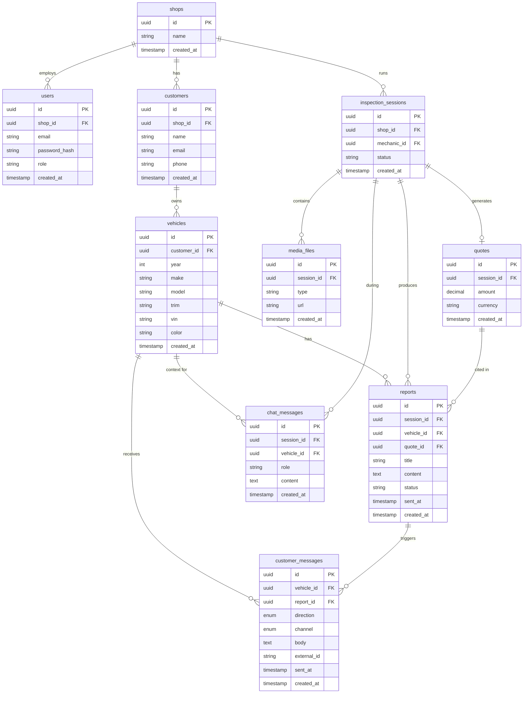

# Sub-project 3: Mobile Chat Interface — Design Spec

**Goal:** Rebuild the iOS and Android apps from inspection recorders into full chat clients that let mechanics communicate with customers (via WhatsApp/email), manage multiple vehicles per customer, generate and send reports, and access the AI assistant — all natively on each platform.

**Architecture:** 3-tab native app on both Android (Jetpack Compose + Material You) and iOS (SwiftUI + HIG), sharing brand identity (colors, typography, spacing) via a cross-platform design token set. The backend gains new REST endpoints and database tables for customers, vehicles, and customer messages; existing inspection / report / AI chat infrastructure is reused unchanged.

**Tech Stack:**
- Android: Kotlin, Jetpack Compose, Material3, Retrofit, OkHttp, EncryptedSharedPreferences
- iOS: Swift, SwiftUI, URLSession, Keychain
- Backend: FastAPI (Python), PostgreSQL (Alembic migrations), Twilio (WhatsApp), SendGrid (email)

---

## 1. Navigation Structure

Three tabs on a persistent bottom bar:

| Tab | Icon | Purpose |
|-----|------|---------|
| Customers | Person group | Customer list → vehicle list → vehicle detail (messages + reports) |
| Assistant | Sparkle / wand | AI chat (existing backend endpoint) |
| Profile | Gear | Account info, logout |

Authentication gate: unauthenticated users see a Login screen before the tab bar. JWT is stored in Android EncryptedSharedPreferences / iOS Keychain and sent as `Authorization: Bearer <token>` on every request.

---

## 2. Screen Flow — Customers Tab

```
Customers List
  └─► Vehicle List  (one customer, all vehicles)
        └─► Vehicle Detail
              ├─► Messages Tab   (WhatsApp / email thread with the physical customer)
              └─► Reports Tab    (report history, generate new, send via WA or email)
```

### 2.1 Customers List
- Search bar (filter by name / phone)
- Each row: customer name, phone, vehicle count badge
- "+ Customer" action creates new customer
- Tap row → Vehicle List

### 2.2 Vehicle List
- Header: customer name, vehicle count
- Cards: year/make/model, VIN preview, message count badge, latest report status
- "+ Vehicle" action adds a vehicle
- Swipe-to-delete (confirm dialog)
- Tap card → Vehicle Detail

### 2.3 Vehicle Detail — Messages Tab
- Chronological thread of `customer_messages` for this vehicle
- Outbound messages (right-aligned, tinted): sent by mechanic via WA or email
- Inbound messages (left-aligned, neutral): received from customer via Twilio webhook
- Channel switcher pill (WhatsApp | Email) persists per customer preference
- Send button POSTs to `/api/customer-messages` → backend delivers via Twilio or SendGrid

### 2.4 Vehicle Detail — Reports Tab
- "Generate New Report" button → triggers AI report generation (same as current inspection flow, but now vehicle-scoped)
- Report list: title, created timestamp, amount, status badge (Draft / Sent)
- Each report card: View · Resend WA · Resend Email actions
- Sending a report also creates a `customer_message` row linking to the report

---

## 3. Screen Flow — Assistant Tab

Unchanged from current AI chat implementation. Wraps existing `/api/chat` backend endpoint. Optionally scoped to a vehicle when launched from the Vehicle Detail screen ("Ask AI about this vehicle").

---

## 4. Screen Flow — Profile Tab

- Display mechanic name, email, shop name
- Logout button (clears JWT from secure storage)
- App version

---

## 5. Authentication

- Single Login screen: email + password → `POST /api/auth/login` → JWT
- JWT stored: Android `EncryptedSharedPreferences`, iOS `Keychain`
- On 401: redirect to Login screen, clear stored token
- No self-registration in the app; accounts created by shop admin

---

## 6. Database Schema

### 6.1 Entity-Relationship Diagram



### 6.2 New Tables

#### `customers`
| Column | Type | Constraints |
|--------|------|-------------|
| id | UUID | PK, default gen_random_uuid() |
| shop_id | UUID | FK → shops.id ON DELETE CASCADE |
| name | VARCHAR(255) | NOT NULL |
| email | VARCHAR(255) | |
| phone | VARCHAR(50) | |
| created_at | TIMESTAMPTZ | NOT NULL, default now() |

#### `vehicles`
| Column | Type | Constraints |
|--------|------|-------------|
| id | UUID | PK, default gen_random_uuid() |
| customer_id | UUID | FK → customers.id ON DELETE CASCADE |
| year | SMALLINT | NOT NULL |
| make | VARCHAR(100) | NOT NULL |
| model | VARCHAR(100) | NOT NULL |
| trim | VARCHAR(100) | |
| vin | VARCHAR(17) | UNIQUE |
| color | VARCHAR(50) | |
| created_at | TIMESTAMPTZ | NOT NULL, default now() |

#### `customer_messages`
| Column | Type | Constraints |
|--------|------|-------------|
| id | UUID | PK, default gen_random_uuid() |
| vehicle_id | UUID | FK → vehicles.id ON DELETE CASCADE |
| report_id | UUID | FK → reports.id ON DELETE SET NULL, nullable |
| direction | VARCHAR(3) | NOT NULL, CHECK IN ('out', 'in') |
| channel | VARCHAR(5) | NOT NULL, CHECK IN ('wa', 'email') |
| body | TEXT | NOT NULL |
| external_id | VARCHAR(255) | nullable (Twilio SID / SendGrid message ID) |
| sent_at | TIMESTAMPTZ | nullable (null = delivery pending/failed) |
| created_at | TIMESTAMPTZ | NOT NULL, default now() |

### 6.3 Modified Tables

#### `reports` — added columns
| Column | Type | Constraints |
|--------|------|-------------|
| vehicle_id | UUID | FK → vehicles.id ON DELETE SET NULL, nullable |
| title | VARCHAR(255) | nullable (back-filled for existing rows) |
| status | VARCHAR(10) | NOT NULL, default 'draft', CHECK IN ('draft', 'sent') |

#### `chat_messages` — added column
| Column | Type | Constraints |
|--------|------|-------------|
| vehicle_id | UUID | FK → vehicles.id ON DELETE SET NULL, nullable |

### 6.4 Unchanged Tables
`shops`, `users`, `inspection_sessions`, `media_files`, `quotes` — no schema changes.

---

## 7. New Backend Endpoints

All endpoints require `Authorization: Bearer <jwt>` and scope results to the mechanic's `shop_id`.

| Method | Path | Description |
|--------|------|-------------|
| GET | `/api/customers` | List customers for current shop |
| POST | `/api/customers` | Create customer |
| GET | `/api/customers/{id}/vehicles` | List vehicles for customer |
| POST | `/api/customers/{id}/vehicles` | Add vehicle |
| DELETE | `/api/vehicles/{id}` | Delete vehicle (cascade messages) |
| GET | `/api/vehicles/{id}/messages` | Thread of customer_messages |
| POST | `/api/vehicles/{id}/messages` | Send message via WA or email |
| GET | `/api/vehicles/{id}/reports` | List reports for vehicle |
| POST | `/api/twilio/webhook` | Receive inbound WhatsApp message from Twilio |

---

## 8. External Integrations

**Twilio (WhatsApp):**
- Outbound: `POST /api/vehicles/{id}/messages` with `channel=wa` → backend calls Twilio Messages API
- Inbound: Twilio sends webhook `POST /api/twilio/webhook` → backend creates `customer_message` with `direction=in`

**SendGrid (email):**
- Outbound: `POST /api/vehicles/{id}/messages` with `channel=email` → backend calls SendGrid Send API
- No inbound email handling in v1

---

## 9. Reused Components (No Change)

- `AudioRecorder` — voice capture (reused for AI assistant voice input)
- `VideoCapture` — camera (reused for inspection photo attachment)
- Existing `/api/chat` AI endpoint — wired directly to the Assistant tab
- Existing inspection session + report generation flow

---

## 10. Out of Scope (v1)

- Customer-facing mobile app (customers receive report links, no app install required)
- Push notifications (mechanic side)
- Inbound email parsing
- Multi-shop admin dashboard
